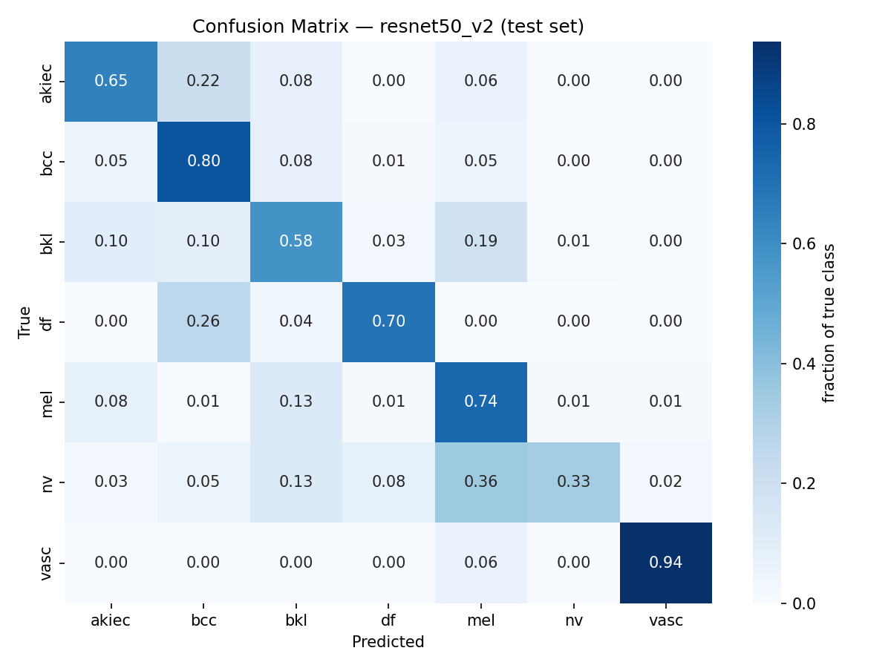
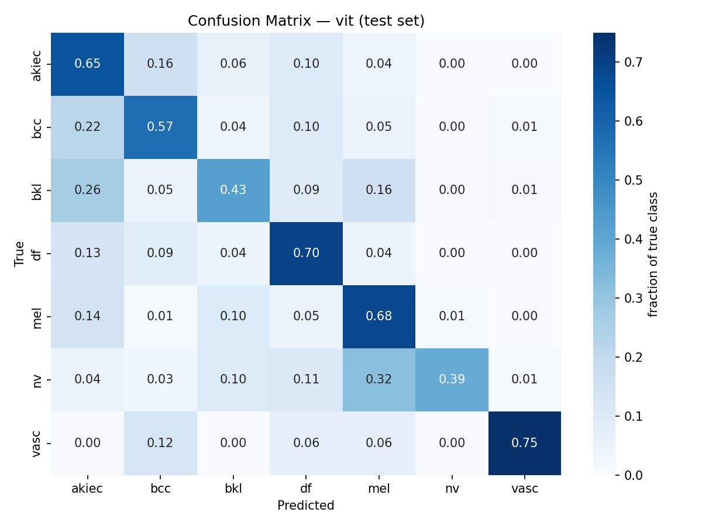

# Hybrid CNN + Vision Transformer for Dermoscopic Lesion Classification
 
**A comparative study of convolutional, transformer-based, and hybrid cross-attention architectures for skin lesion classification on HAM10000.**
 
[]()
[]()
[]()
[]()
 
---
## Abstract
 
Convolutional Neural Networks (CNNs) excel at capturing local texture and edge information but lack an inherent mechanism for modeling long-range spatial context. Vision Transformers (ViTs) address this via global self-attention, but typically require large-scale pretraining data to learn the inductive biases CNNs get for free. This project investigates a **hybrid CNN–ViT architecture with cross-attention fusion**, designed to combine the local feature sensitivity of CNNs with the global contextual reasoning of transformers, applied to the clinically-relevant task of dermoscopic skin lesion classification on the **HAM10000** dataset (7 diagnostic classes, 10,015 images).
 
This repository documents the full experimental pipeline — data preparation, baseline models, the hybrid architecture, and iterative refinement — in the style of a running lab notebook. Version 1 (V1) results below surfaced an important negative finding around class-imbalance handling, which directly motivated the corrected V2 pipeline.
 
---

## Table of Contents
 
- [Motivation](#motivation)
- [Dataset](#dataset)
- [Methodology](#methodology)
- [Experimental Setup](#experimental-setup)
- [Results — V1 (ResNet50 Baseline)](#results--v1-resnet50-baseline)
- [Results — V2 (ResNet50, Sampler Removed)](#results--v2-resnet50-sampler-removed)
- [Results — ViT-Small Baseline](#results--vit-small-baseline)
- [Findings & Discussion](#findings--discussion)
- [Roadmap](#roadmap)
- [Repository Structure](#repository-structure)
- [Setup & Reproduction](#setup--reproduction)
- [Acknowledgments](#acknowledgments)

---

## Motivation
 
Standard CNNs (ResNet, EfficientNet, etc.) remain the dominant architecture for dermoscopic image classification, but they process images through a fixed local receptive field that grows only gradually with depth. This makes it harder for a CNN to relate a lesion's border characteristics to its overall shape and surrounding skin context in a single representational step — information that's often clinically relevant (e.g. asymmetry, border irregularity, per the ABCDE rule used in dermatology).
 
Vision Transformers model global relationships from the first layer via self-attention, but are known to underperform CNNs on small-to-medium datasets without large-scale pretraining, since they lack CNNs' built-in translation-invariance and locality priors.
 
**This project's central hypothesis:** a hybrid architecture — CNN backbone for local feature extraction, feeding a lightweight transformer encoder with explicit cross-attention back to the CNN's feature maps — can outperform either architecture alone on a mid-sized medical imaging dataset, by combining local and global reasoning rather than relying on either in isolation.
 
---

## Dataset
 
**HAM10000** ("Human Against Machine with 10000 training images") — 10,015 dermoscopic images across 7 diagnostic categories:
 
| Class | Full name | Count | % of dataset |
|---|---|---:|---:|
| `nv` | Melanocytic nevi | 6,705 | 66.9% |
| `mel` | Melanoma | 1,113 | 11.1% |
| `bkl` | Benign keratosis-like lesions | 1,099 | 11.0% |
| `bcc` | Basal cell carcinoma | 514 | 5.1% |
| `akiec` | Actinic keratoses / intraepithelial carcinoma | 327 | 3.3% |
| `vasc` | Vascular lesions | 142 | 1.4% |
| `df` | Dermatofibroma | 115 | 1.1% |
 
The dataset exhibits severe class imbalance (58× ratio between the largest and smallest class) and contains multiple images per lesion (7,470 unique lesions across 10,015 images) — both factors that directly shaped the methodology below.
 
Source: [Tschandl et al., 2018 — "The HAM10000 dataset"](https://doi.org/10.1038/sdata.2018.161), via [Kaggle](https://www.kaggle.com/datasets/kmader/skin-cancer-mnist-ham10000).
 
---

## Methodology
 
### Data pipeline
 
- **Lesion-level train/val/test split** (70/15/15), not row-level — since multiple photos can share a `lesion_id`, a naive random split would leak the same lesion across splits and inflate validation metrics. Implemented in [`src/data/prepare_data.py`](src/data/prepare_data.py).
- **Hair-artifact removal** via a morphological black-hat filter + inpainting (DullRazor-style), since a substantial fraction of HAM10000 images have hair overlapping the lesion — a spurious feature a CNN in particular can latch onto.
- **Augmentation**: horizontal/vertical flip, rotation (±25°), color jitter, brightness/contrast jitter — standard dermoscopic augmentation, since lesions have no canonical orientation.
- **Class-imbalance handling**: focal loss (γ=2.0) with inverse-frequency class weighting. (V1 additionally used a weighted random sampler — see [Findings](#findings--discussion) for why this was removed in V2.)

### Models under comparison
 
| Model | Role | Status |
|---|---|---|
| ResNet50 | Pure-CNN baseline | ✅ V1 complete, ✅ V2 complete |
| ViT-Small/16 | Pure-transformer baseline | ✅ complete |
| CNN+ViT Hybrid (cross-attention fusion) | Proposed architecture | ⏳ planned |
 
---

## Experimental Setup
 
| Parameter | Value |
|---|---|
| Backbone | ResNet50 (ImageNet-pretrained) |
| Input resolution | 224×224 |
| Batch size | 32 |
| Optimizer | AdamW (lr=3e-4, weight_decay=1e-4) |
| LR schedule | Cosine annealing |
| Loss | Focal loss (γ=2.0), class-weighted |
| Mixed precision | Enabled (fp16) |
| Epochs | 40 (early stopping patience=8) |
| Hardware | Google Colab, NVIDIA T4 |
| Checkpoint selection | Best validation macro-F1 |
 
Full configuration: [`configs/config.yaml`](configs/config.yaml).
 
---

## Results — V1 (ResNet50 Baseline)
 
**Test set: 1,516 held-out images (never seen during training or checkpoint selection)**
 
| Metric | Value |
|---|---:|
| Accuracy | 0.2434 |
| Precision (macro) | 0.3888 |
| Recall (macro) | 0.6197 |
| **F1 (macro)** | **0.3525** |
| AUC-ROC (macro) | 0.8669 |
 
**Per-class F1:**
 
| Class | F1 Score |
|---|---:|
| akiec | 0.4962 |
| bcc | 0.4825 |
| bkl | 0.3276 |
| df | 0.3409 |
| mel | 0.2754 |
| **nv** | **0.0609** |
| vasc | 0.4839 |
 
**Confusion matrix** (row-normalized — each cell shows the fraction of a true class predicted as each label):
 

 
**Full result artifacts:**
- [`results/resnet50/metrics.json`](results/resnet50/metrics.json) — complete numeric results, machine-readable
- [`results/resnet50/metrics.csv`](results/resnet50/metrics.csv) — per-class table
- [`results/resnet50/confusion_matrix.png`](results/resnet50/confusion_matrix.png) — plotted confusion matrix
- [`results/resnet50/summary.md`](results/resnet50/summary.md) — generated summary
- Training curves (loss, val F1, val AUC-ROC per epoch): [Weights & Biases run](https://wandb.ai/skjishan-indian-institute-of-information-technology-kalyani/hybrid-cnn-vit-medical) *(add your specific run URL here)*
- Trained checkpoint: `resnet50_best.pt` *(not version-controlled — see [Setup & Reproduction](#setup--reproduction))*
---
## Results — V2 (ResNet50, Sampler Removed)
 
**Change from V1:** the `WeightedRandomSampler` was removed from the training `DataLoader` (`shuffle=True` replacing `sampler=sampler`); focal loss with class weighting remains as the sole imbalance-handling mechanism. All other hyperparameters, architecture, data splits, and augmentation are identical to V1 — this is a controlled, single-variable ablation.
 
**Test set: 1,508 held-out images**
 
| Metric | V1 | V2 | Δ |
|---|---:|---:|---:|
| Accuracy | 0.2434 | **0.4483** | +0.2049 |
| Precision (macro) | 0.3888 | **0.4091** | +0.0203 |
| Recall (macro) | 0.6197 | **0.6762** | +0.0565 |
| F1 (macro) | 0.3525 | **0.4365** | +0.0840 |
| AUC-ROC (macro) | 0.8669 | **0.8997** | +0.0328 |
 
**Per-class F1 — V1 vs. V2:**
 
| Class | V1 F1 | V2 F1 | Δ |
|---|---:|---:|---:|
| akiec | 0.4962 | 0.4521 | −0.0441 |
| bcc | 0.4825 | 0.5398 | +0.0573 |
| bkl | 0.3276 | 0.4743 | +0.1467 |
| df | 0.3409 | 0.2462 | **−0.0947** |
| mel | 0.2754 | 0.3272 | +0.0518 |
| **nv** | **0.0609** | **0.4989** | **+0.4380** |
| vasc | 0.4839 | 0.5172 | +0.0333 |
 
**Confusion matrix (V2):**
 

 
**Full result artifacts:**
- [`results/resnet50_v2/metrics.json`](results/resnet50_v2/metrics.json)
- [`results/resnet50_v2/metrics.csv`](results/resnet50_v2/metrics.csv)
- [`results/resnet50_v2/confusion_matrix.png`](results/resnet50_v2/confusion_matrix.png)
- [`results/resnet50_v2/summary.md`](results/resnet50_v2/summary.md)

*Note: V2's test set (1,508 images) differs slightly from V1's (1,516) due to 
intermittent file-read failures on Drive-mounted storage during evaluation — 
see the `dataset.py` fix below. The 8-image difference (<0.5%) is not expected 
to materially affect the comparison.*
---

## Results — ViT-Small Baseline
 
**Architecture:** `vit_small_patch16_224`, ImageNet-pretrained, fine-tuned with an identical pipeline to ResNet50 V2 (same data splits, augmentation, focal loss, hyperparameters — only the model architecture differs). This is the second of the three planned comparison points.
 
**Test set: 1,516 images**
 
| Metric | Value |
|---|---:|
| Accuracy | 0.4466 |
| Precision (macro) | 0.3983 |
| Recall (macro) | 0.5944 |
| F1 (macro) | 0.4041 |
| AUC-ROC (macro) | 0.8592 |
 
**Per-class F1:**
 
| Class | F1 Score |
|---|---:|
| akiec | 0.3070 |
| bcc | 0.5057 |
| bkl | 0.4031 |
| df | 0.1711 |
| mel | 0.3267 |
| nv | 0.5569 |
| vasc | 0.5581 |
 
**Confusion matrix:**
 

 
**Full result artifacts:**
- [`results/vit/metrics.json`](results/vit/metrics.json)
- [`results/vit/metrics.csv`](results/vit/metrics.csv)
- [`results/vit/confusion_matrix.png`](results/vit/confusion_matrix.png)
- [`results/vit/summary.md`](results/vit/summary.md)

### CNN vs. ViT — the baseline comparison
 
| Metric | ResNet50 (V2) | ViT-Small | Δ (ViT − ResNet) |
|---|---:|---:|---:|
| Accuracy | **0.4483** | 0.4466 | −0.0017 |
| Precision (macro) | **0.4091** | 0.3983 | −0.0108 |
| Recall (macro) | **0.6762** | 0.5944 | −0.0818 |
| F1 (macro) | **0.4365** | 0.4041 | −0.0324 |
| AUC-ROC (macro) | **0.8997** | 0.8592 | −0.0405 |
 
**ResNet50 outperforms ViT-Small on every aggregate metric.** This is the expected result, not a disappointing one: it directly confirms the premise motivating this project. Vision Transformers lack the built-in locality and translation-invariance priors that convolutional architectures get for free, and typically require substantially more pretraining/fine-tuning data than ResNet-family models to compensate. With roughly 7,000 training images — a mid-sized dataset by deep learning standards — the CNN's inductive bias appears to still provide a meaningful advantage over the transformer's more data-hungry, globally-attending representation.
 
**Per-class F1 — CNN vs. ViT:**
 
| Class | ResNet50 (V2) | ViT-Small | Δ (ViT − ResNet) |
|---|---:|---:|---:|
| akiec | **0.4521** | 0.3070 | −0.1451 |
| bcc | **0.5398** | 0.5057 | −0.0341 |
| bkl | **0.4743** | 0.4031 | −0.0712 |
| df | **0.2462** | 0.1711 | −0.0751 |
| mel | 0.3272 | 0.3267 | ≈ 0.0000 |
| nv | 0.4989 | **0.5569** | +0.0580 |
| vasc | 0.5172 | **0.5581** | +0.0409 |
 
A more specific pattern emerges at the per-class level than the aggregate numbers alone suggest: **ViT outperforms ResNet specifically on the two classes with either the most training data (`nv`) or the most visually distinct decision boundary (`vasc`), but underperforms on nearly every class in between** — most sharply on `akiec` and `df`, both comparatively data-scarce classes. This suggests ViT's global self-attention becomes advantageous once sufficient data or visual separability is available to exploit it, but its lack of local inductive bias is a specific liability precisely where training data is limited — which is the direct motivation for the hybrid architecture below: retaining CNN-style local feature extraction while adding transformer-style global context, rather than choosing one inductive bias over the other.
 
---


## Findings & Discussion
 
### A class-imbalance overcorrection
 
The headline number in V1 is not the macro-F1 of 0.3525 — it's the **per-class F1 on `nv`, the majority class, collapsing to 0.0609**, while several minority classes (`vasc`: 0.484, comprising only 1.4% of the dataset) scored substantially higher. Overall test accuracy (24.3%) fell *below* the trivial baseline of always predicting the majority class (~67% accuracy), indicating the trained model performed **worse than doing nothing** on raw accuracy, despite a respectable macro-AUC-ROC of 0.867 showing the model's underlying class probabilities were still reasonably well-ranked.
 
**Root cause:** V1's training pipeline applied two class-imbalance corrections simultaneously:
1. A `WeightedRandomSampler` performing inverse-frequency sampling at the batch level (equalizing class exposure during training), and
2. Focal loss with inverse-frequency class weighting applied a second time, in the loss computation itself.
Applying both mechanisms compounds the correction well beyond what the data's true imbalance warrants, effectively teaching the model to *avoid* predicting the majority class rather than to weigh all classes fairly. This is a documented failure mode in imbalanced classification literature, but one that's easy to introduce by combining "standard" techniques without checking for redundancy between them.
 
**Corrective action (V2):** the weighted sampler is removed; focal loss with class weighting remains as the sole imbalance-handling mechanism. This is a clean, single-variable ablation — V1 → V2 isolates the effect of the sampler in an otherwise identical pipeline, architecture, and hyperparameter set.

### Interpreting V1 → V2: a fix, not a free lunch
 
Every aggregate metric improved, and the `nv` collapse identified in V1 is resolved — F1 on the majority class rose from 0.0609 to 0.4989, a roughly 8× improvement, confirming the double-correction hypothesis above. This is the clearest evidence in the project so far that class-imbalance handling techniques can interact destructively when stacked without checking for redundancy.

However, the fix is not uniformly positive, and two results are worth reporting honestly rather than only highlighting the headline gains:
 
**1. Performance on `df` (dermatofibroma) declined (F1: 0.3409 → 0.2462).** `df` is the rarest class in HAM10000 (115 images, 1.1% of the dataset). The weighted sampler had been artificially inflating its exposure during training; removing it means the model now sees `df` at its true, scarce natural frequency, with correspondingly less signal to learn from. This is best understood as the direct cost of the same change that fixed `nv` — the sampler was propping up tail-class recall at the expense of head-class performance, and removing it reverses that trade in both directions simultaneously.

**2. Melanoma (`mel`) detection remains comparatively weak (F1: 0.3272).** This matters more than the raw number suggests: `mel` is the class where a missed or incorrect classification carries the highest real-world clinical cost, since melanoma is the most dangerous of the seven categories and early detection materially affects patient outcomes. The modest V1→V2 improvement (+0.0518) is welcome but insufficient — `mel` remains the second-weakest class after `df`. **Aggregate metrics improving does not, by itself, indicate the model is clinically better** if the improvement is concentrated in lower-stakes classes while the highest-stakes class lags behind. Per-class reporting (rather than accuracy or macro-F1 alone) is necessary to surface this, and is why this project reports per-class F1 throughout rather than relying on summary statistics.


**Implication for future work:** uniform inverse-frequency correction (whether via sampling or loss weighting) treats all minority classes identically, but HAM10000's classes are not equally minority, nor equally clinically important. A more targeted approach — e.g., class-balanced loss reweighting (Cui et al., 2019) restricted to the one or two rarest classes, or a clinically-weighted loss that up-weights `mel` specifically regardless of its frequency — is a natural next refinement, and a candidate ablation once the hybrid architecture is in place.


### Why this is reported, not hidden
 
Negative or unexpected results are part of a complete experimental record. Reporting V1 as-is — rather than silently discarding it — provides:
- A concrete, empirical demonstration of an overcorrection failure mode in imbalanced multi-class classification
- A controlled ablation baseline for evaluating the sampler's specific contribution in V2
- Evidence that macro-AUC-ROC and macro-F1/accuracy can diverge sharply under severe imbalance, reinforcing why multiple complementary metrics (not accuracy alone) are necessary for evaluating models on imbalanced medical imaging data
---

## Roadmap
 
- [x] Data pipeline: lesion-level split, hair removal, augmentation
- [x] ResNet50 baseline — V1 (sampler + focal loss, overcorrection identified)
- [x] ResNet50 baseline — V2 (focal loss only; sampler removed)
- [ ] ViT-Small/16 baseline
- [ ] Hybrid CNN+ViT architecture (cross-attention fusion + dual-attention gate)
- [ ] Multi-seed runs (3–5 seeds per model) with statistical significance testing
- [ ] Ablation studies: cross-attention on/off, fusion gate vs. fixed blend, transformer depth
- [ ] Grad-CAM comparison across all three architectures
- [ ] Final report / write-up
---

## Repository Structure
 
```
hybrid-cnn-vit-medical/
├── configs/
│   └── config.yaml              # single source of truth for all hyperparameters
├── src/
│   ├── data/
│   │   ├── prepare_data.py      # download → lesion-level split → folder layout
│   │   └── dataset.py           # Dataset class: hair removal, augmentation, sampling
│   ├── models/
│   │   └── baseline_resnet.py   # ResNet50 via timm
│   ├── utils/
│   │   ├── losses.py            # focal loss for class imbalance
│   │   └── metrics.py           # accuracy/precision/recall/F1/AUC-ROC, per-class breakdown
│   ├── train.py                 # training loop, checkpoint-resume support
│   ├── evaluate.py              # test-set evaluation from a saved checkpoint
│   └── save_results.py          # exports metrics.json/csv, confusion matrix image, summary.md
├── results/
│   ├── resnet50/                 # V1 results — metrics, confusion matrix, summary
│   └── resnet50_v2/              # V2 results — sampler removed
├── checkpoints/                 # trained weights (gitignored — see below)
└── README.md
```

 
---

## Setup & Reproduction
 
```bash
pip install -r requirements.txt
 
# 1. Download HAM10000 (requires a Kaggle API token)
kaggle datasets download -d kmader/skin-cancer-mnist-ham10000 -p data/raw --unzip
 
# 2. Lesion-level train/val/test split
python src/data/prepare_data.py --config configs/config.yaml
 
# 3. Train
python src/train.py --config configs/config.yaml
 
# 4. Evaluate on held-out test set
python src/evaluate.py --config configs/config.yaml --checkpoint checkpoints/resnet50_best.pt
 
# 5. Export report-ready results
python src/save_results.py --config configs/config.yaml --checkpoint checkpoints/resnet50_best.pt --model_name resnet50
```

**Note on trained weights:** `.pt` checkpoint files are intentionally excluded from version control (see `.gitignore`) — they're large binaries best stored outside git history. Trained checkpoints for this project are archived separately; results in this README were produced from the checkpoint referenced above.
 
---

## Citation
 
If referencing the HAM10000 dataset itself:
 
```bibtex
@article{tschandl2018ham10000,
  title={The HAM10000 dataset, a large collection of multi-source dermatoscopic images of common pigmented skin lesions},
  author={Tschandl, Philipp and Rosendahl, Cliff and Kittler, Harald},
  journal={Scientific Data},
  volume={5},
  pages={180161},
  year={2018},
  publisher={Nature Publishing Group}
}
```

## Acknowledgments
 
Built on top of [`timm`](https://github.com/huggingface/pytorch-image-models) for pretrained backbones, [`albumentations`](https://albumentations.ai/) for augmentation, and [Weights & Biases](https://wandb.ai/) for experiment tracking.
 


## License
 
MIT — see [`LICENSE`](LICENSE).