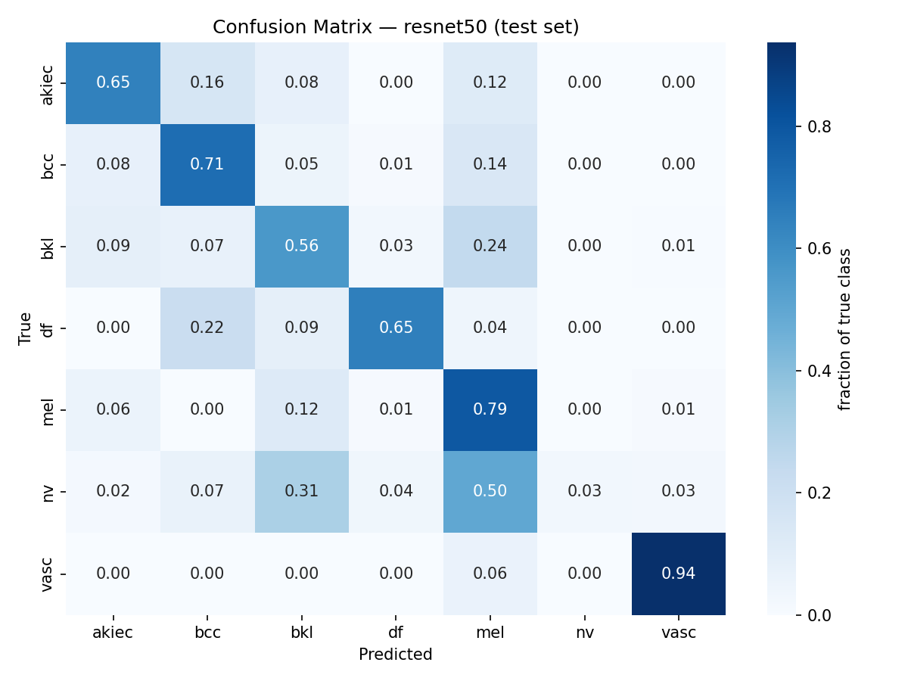

# Hybrid CNN + Vision Transformer for Dermoscopic Lesion Classification
 
**A comparative study of convolutional, transformer-based, and hybrid cross-attention architectures for skin lesion classification on HAM10000.**
 
[]()
[]()
[]()
[]()
 
---
## Abstract
 
Convolutional Neural Networks (CNNs) excel at capturing local texture and edge information but lack an inherent mechanism for modeling long-range spatial context. Vision Transformers (ViTs) address this via global self-attention, but typically require large-scale pretraining data to learn the inductive biases CNNs get for free. This project investigates a **hybrid CNN–ViT architecture with cross-attention fusion**, designed to combine the local feature sensitivity of CNNs with the global contextual reasoning of transformers, applied to the clinically-relevant task of dermoscopic skin lesion classification on the **HAM10000** dataset (7 diagnostic classes, 10,015 images).
 
This repository documents the full experimental pipeline — data preparation, baseline models, the hybrid architecture, and iterative refinement — in the style of a running lab notebook. Version 1 (V1) results below surfaced an important negative finding around class-imbalance handling, which directly motivated the corrected V2 pipeline.
 
---

## Table of Contents
 
- [Motivation](#motivation)
- [Dataset](#dataset)
- [Methodology](#methodology)
- [Experimental Setup](#experimental-setup)
- [Results — V1 (ResNet50 Baseline)](#results--v1-resnet50-baseline)
- [Findings & Discussion](#findings--discussion)
- [Roadmap](#roadmap)
- [Repository Structure](#repository-structure)
- [Setup & Reproduction](#setup--reproduction)
- [Acknowledgments](#acknowledgments)
---

## Motivation
 
Standard CNNs (ResNet, EfficientNet, etc.) remain the dominant architecture for dermoscopic image classification, but they process images through a fixed local receptive field that grows only gradually with depth. This makes it harder for a CNN to relate a lesion's border characteristics to its overall shape and surrounding skin context in a single representational step — information that's often clinically relevant (e.g. asymmetry, border irregularity, per the ABCDE rule used in dermatology).
 
Vision Transformers model global relationships from the first layer via self-attention, but are known to underperform CNNs on small-to-medium datasets without large-scale pretraining, since they lack CNNs' built-in translation-invariance and locality priors.
 
**This project's central hypothesis:** a hybrid architecture — CNN backbone for local feature extraction, feeding a lightweight transformer encoder with explicit cross-attention back to the CNN's feature maps — can outperform either architecture alone on a mid-sized medical imaging dataset, by combining local and global reasoning rather than relying on either in isolation.
 
---

## Dataset
 
**HAM10000** ("Human Against Machine with 10000 training images") — 10,015 dermoscopic images across 7 diagnostic categories:
 
| Class | Full name | Count | % of dataset |
|---|---|---:|---:|
| `nv` | Melanocytic nevi | 6,705 | 66.9% |
| `mel` | Melanoma | 1,113 | 11.1% |
| `bkl` | Benign keratosis-like lesions | 1,099 | 11.0% |
| `bcc` | Basal cell carcinoma | 514 | 5.1% |
| `akiec` | Actinic keratoses / intraepithelial carcinoma | 327 | 3.3% |
| `vasc` | Vascular lesions | 142 | 1.4% |
| `df` | Dermatofibroma | 115 | 1.1% |
 
The dataset exhibits severe class imbalance (58× ratio between the largest and smallest class) and contains multiple images per lesion (7,470 unique lesions across 10,015 images) — both factors that directly shaped the methodology below.
 
Source: [Tschandl et al., 2018 — "The HAM10000 dataset"](https://doi.org/10.1038/sdata.2018.161), via [Kaggle](https://www.kaggle.com/datasets/kmader/skin-cancer-mnist-ham10000).
 
---

## Methodology
 
### Data pipeline
 
- **Lesion-level train/val/test split** (70/15/15), not row-level — since multiple photos can share a `lesion_id`, a naive random split would leak the same lesion across splits and inflate validation metrics. Implemented in [`src/data/prepare_data.py`](src/data/prepare_data.py).
- **Hair-artifact removal** via a morphological black-hat filter + inpainting (DullRazor-style), since a substantial fraction of HAM10000 images have hair overlapping the lesion — a spurious feature a CNN in particular can latch onto.
- **Augmentation**: horizontal/vertical flip, rotation (±25°), color jitter, brightness/contrast jitter — standard dermoscopic augmentation, since lesions have no canonical orientation.
- **Class-imbalance handling**: focal loss (γ=2.0) with inverse-frequency class weighting. (V1 additionally used a weighted random sampler — see [Findings](#findings--discussion) for why this was removed in V2.)

### Models under comparison
 
| Model | Role | Status |
|---|---|---|
| ResNet50 | Pure-CNN baseline | ✅ V1 complete, V2 in progress |
| ViT-Small/16 | Pure-transformer baseline | ⏳ planned |
| CNN+ViT Hybrid (cross-attention fusion) | Proposed architecture | ⏳ planned |
 
---

## Experimental Setup
 
| Parameter | Value |
|---|---|
| Backbone | ResNet50 (ImageNet-pretrained) |
| Input resolution | 224×224 |
| Batch size | 32 |
| Optimizer | AdamW (lr=3e-4, weight_decay=1e-4) |
| LR schedule | Cosine annealing |
| Loss | Focal loss (γ=2.0), class-weighted |
| Mixed precision | Enabled (fp16) |
| Epochs | 40 (early stopping patience=8) |
| Hardware | Google Colab, NVIDIA T4 |
| Checkpoint selection | Best validation macro-F1 |
 
Full configuration: [`configs/config.yaml`](configs/config.yaml).
 
---

## Results — V1 (ResNet50 Baseline)
 
**Test set: 1,516 held-out images (never seen during training or checkpoint selection)**
 
| Metric | Value |
|---|---:|
| Accuracy | 0.2434 |
| Precision (macro) | 0.3888 |
| Recall (macro) | 0.6197 |
| **F1 (macro)** | **0.3525** |
| AUC-ROC (macro) | 0.8669 |
 
**Per-class F1:**
 
| Class | F1 Score |
|---|---:|
| akiec | 0.4962 |
| bcc | 0.4825 |
| bkl | 0.3276 |
| df | 0.3409 |
| mel | 0.2754 |
| **nv** | **0.0609** |
| vasc | 0.4839 |
 
**Confusion matrix** (row-normalized — each cell shows the fraction of a true class predicted as each label):
 

 
**Full result artifacts:**
- [`results/resnet50/metrics.json`](results/resnet50/metrics.json) — complete numeric results, machine-readable
- [`results/resnet50/metrics.csv`](results/resnet50/metrics.csv) — per-class table
- [`results/resnet50/confusion_matrix.png`](results/resnet50/confusion_matrix.png) — plotted confusion matrix
- [`results/resnet50/summary.md`](results/resnet50/summary.md) — generated summary
- Training curves (loss, val F1, val AUC-ROC per epoch): [Weights & Biases run](https://wandb.ai/skjishan-indian-institute-of-information-technology-kalyani/hybrid-cnn-vit-medical) *(add your specific run URL here)*
- Trained checkpoint: `resnet50_best.pt` *(not version-controlled — see [Setup & Reproduction](#setup--reproduction))*
---

## Findings & Discussion
 
### A class-imbalance overcorrection
 
The headline number in V1 is not the macro-F1 of 0.3525 — it's the **per-class F1 on `nv`, the majority class, collapsing to 0.0609**, while several minority classes (`vasc`: 0.484, comprising only 1.4% of the dataset) scored substantially higher. Overall test accuracy (24.3%) fell *below* the trivial baseline of always predicting the majority class (~67% accuracy), indicating the trained model performed **worse than doing nothing** on raw accuracy, despite a respectable macro-AUC-ROC of 0.867 showing the model's underlying class probabilities were still reasonably well-ranked.
 
**Root cause:** V1's training pipeline applied two class-imbalance corrections simultaneously:
1. A `WeightedRandomSampler` performing inverse-frequency sampling at the batch level (equalizing class exposure during training), and
2. Focal loss with inverse-frequency class weighting applied a second time, in the loss computation itself.
Applying both mechanisms compounds the correction well beyond what the data's true imbalance warrants, effectively teaching the model to *avoid* predicting the majority class rather than to weigh all classes fairly. This is a documented failure mode in imbalanced classification literature, but one that's easy to introduce by combining "standard" techniques without checking for redundancy between them.
 
**Corrective action (V2):** the weighted sampler is removed; focal loss with class weighting remains as the sole imbalance-handling mechanism. This is a clean, single-variable ablation — V1 → V2 isolates the effect of the sampler in an otherwise identical pipeline, architecture, and hyperparameter set. V2 results will be added here once training completes.

### Why this is reported, not hidden
 
Negative or unexpected results are part of a complete experimental record. Reporting V1 as-is — rather than silently discarding it — provides:
- A concrete, empirical demonstration of an overcorrection failure mode in imbalanced multi-class classification
- A controlled ablation baseline for evaluating the sampler's specific contribution in V2
- Evidence that macro-AUC-ROC and macro-F1/accuracy can diverge sharply under severe imbalance, reinforcing why multiple complementary metrics (not accuracy alone) are necessary for evaluating models on imbalanced medical imaging data
---

## Roadmap
 
- [x] Data pipeline: lesion-level split, hair removal, augmentation
- [x] ResNet50 baseline — V1 (sampler + focal loss, overcorrection identified)
- [x] ResNet50 baseline — V2 (focal loss only; sampler removed)
- [ ] ViT-Small/16 baseline
- [ ] Hybrid CNN+ViT architecture (cross-attention fusion + dual-attention gate)
- [ ] Multi-seed runs (3–5 seeds per model) with statistical significance testing
- [ ] Ablation studies: cross-attention on/off, fusion gate vs. fixed blend, transformer depth
- [ ] Grad-CAM comparison across all three architectures
- [ ] Final report / write-up
---

## Repository Structure
 
```
hybrid-cnn-vit-medical/
├── configs/
│   └── config.yaml              # single source of truth for all hyperparameters
├── src/
│   ├── data/
│   │   ├── prepare_data.py      # download → lesion-level split → folder layout
│   │   └── dataset.py           # Dataset class: hair removal, augmentation, sampling
│   ├── models/
│   │   └── baseline_resnet.py   # ResNet50 via timm
│   ├── utils/
│   │   ├── losses.py            # focal loss for class imbalance
│   │   └── metrics.py           # accuracy/precision/recall/F1/AUC-ROC, per-class breakdown
│   ├── train.py                 # training loop, checkpoint-resume support
│   ├── evaluate.py              # test-set evaluation from a saved checkpoint
│   └── save_results.py          # exports metrics.json/csv, confusion matrix image, summary.md
├── results/
│   └── resnet50/                # V1 results — metrics, confusion matrix, summary
├── checkpoints/                 # trained weights (gitignored — see below)
└── README.md
```
 
---

## Setup & Reproduction
 
```bash
pip install -r requirements.txt
 
# 1. Download HAM10000 (requires a Kaggle API token)
kaggle datasets download -d kmader/skin-cancer-mnist-ham10000 -p data/raw --unzip
 
# 2. Lesion-level train/val/test split
python src/data/prepare_data.py --config configs/config.yaml
 
# 3. Train
python src/train.py --config configs/config.yaml
 
# 4. Evaluate on held-out test set
python src/evaluate.py --config configs/config.yaml --checkpoint checkpoints/resnet50_best.pt
 
# 5. Export report-ready results
python src/save_results.py --config configs/config.yaml --checkpoint checkpoints/resnet50_best.pt --model_name resnet50
```

**Note on trained weights:** `.pt` checkpoint files are intentionally excluded from version control (see `.gitignore`) — they're large binaries best stored outside git history. Trained checkpoints for this project are archived separately; results in this README were produced from the checkpoint referenced above.
 
---

## Citation
 
If referencing the HAM10000 dataset itself:
 
```bibtex
@article{tschandl2018ham10000,
  title={The HAM10000 dataset, a large collection of multi-source dermatoscopic images of common pigmented skin lesions},
  author={Tschandl, Philipp and Rosendahl, Cliff and Kittler, Harald},
  journal={Scientific Data},
  volume={5},
  pages={180161},
  year={2018},
  publisher={Nature Publishing Group}
}
```

## License
 
MIT — see [`LICENSE`](LICENSE).